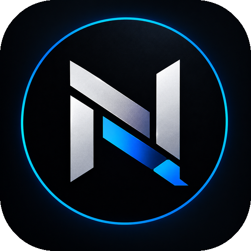
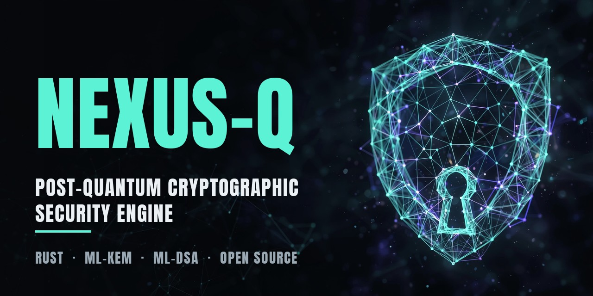
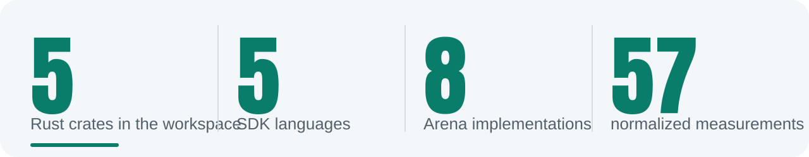
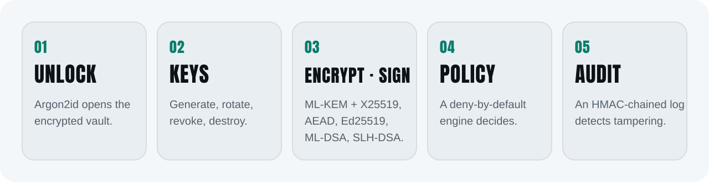
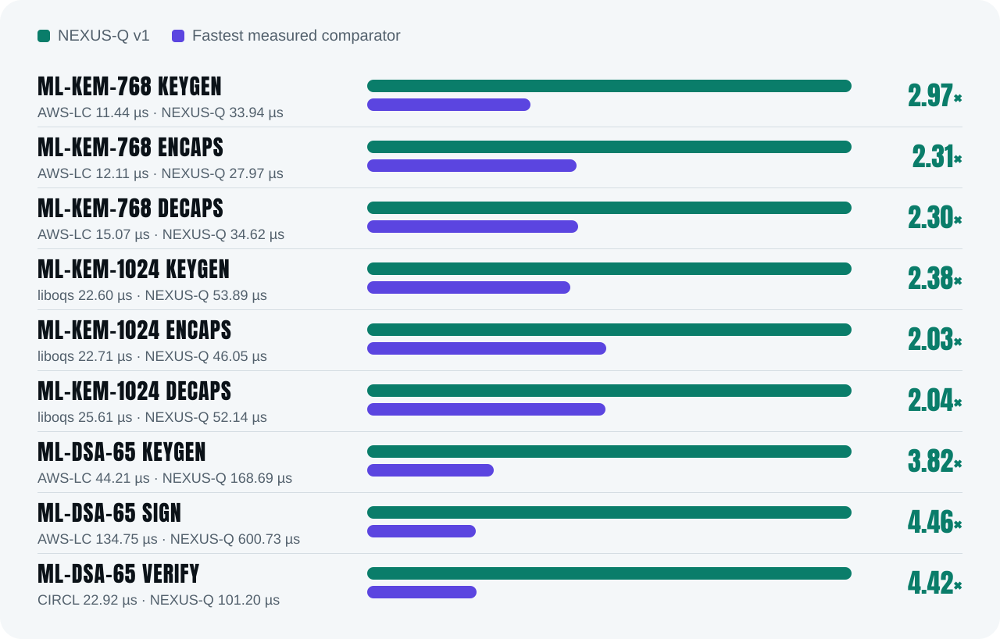

<div align="center">





[](https://github.com/lecodev-26/nexus-q/actions/workflows/security-ci.yml) [](https://github.com/lecodev-26/nexus-q/actions/workflows/sdk-ci.yml) [](https://github.com/lecodev-26/nexus-q/actions/workflows/benchmarks.yml) [](https://github.com/lecodev-26/nexus-q/actions/workflows/pqc-arena.yml) [](https://opensource.org/license/mit)

<a href="https://nexus-q-topaz.vercel.app"><picture><source media="(prefers-color-scheme: dark)" srcset="assets/dark/b-site.svg"></picture></a>&nbsp;<a href="https://github.com/lecodev-26/nexus-q/releases/latest"><picture><source media="(prefers-color-scheme: dark)" srcset="assets/dark/b-rel.svg"></picture></a>&nbsp;<a href="docs/user/README.md"><picture><source media="(prefers-color-scheme: dark)" srcset="assets/dark/b-docs.svg"></picture></a>&nbsp;<a href="SECURITY.md"><picture><source media="(prefers-color-scheme: dark)" srcset="assets/dark/b-sec.svg"></picture></a>

**Post-quantum cryptographic security engine for protecting data, keys, and identities.**<br>A plain-language tour of the project lives on the website: [nexus-q-topaz.vercel.app](https://nexus-q-topaz.vercel.app).

</div>

> **Version status (2026-10-09):** V1 is the frozen baseline (`v1.0.0`); V2 is frozen on `nexusqv2` (`v2.0.0`); V3 has been integrated into `main` by [PR #45](https://github.com/lecodev-26/nexus-q/pull/45), with V3 Incremental CI and PQC Benchmark Arena evidence retained. The release includes a downloadable evidence archive and SHA-256 manifest. Post-release `main` CI and four-hour fuzz soaks are tracked separately; see the linked Actions runs for their current status. V4 is the planned architecture-specific performance-kernel line tracked by [Issue #23](https://github.com/lecodev-26/nexus-q/issues/23). **No independent audit, certification, or downstream registry publication is implied.**

<div align="center">

<picture><source media="(prefers-color-scheme: dark)" srcset="assets/dark/stats.svg"></picture>

</div>

<div align="center">

<picture><source media="(prefers-color-scheme: dark)" srcset="assets/dark/h-overview.svg"></picture>

</div>

NEXUS-Q is a post-quantum cryptographic security engine designed to protect:

| 🔒 Data | 🗝️ Keys | 🪪 Identities |
|---|---|---|
| Authenticated encryption of files and streams. | Full lifecycle management: generation, rotation, revocation, destruction. | Digital signatures and verifiable credentials. |

It is intended as a cryptographic/security engine for applications and servers. The repository also defines hardware-provider abstraction points for future TPM, HSM, Secure Element, enclave and RISC-V integrations; the default software backend does not itself provide hardware isolation.

<div align="center">

<picture><source media="(prefers-color-scheme: dark)" srcset="assets/dark/h-how.svg"></picture>

</div>

<div align="center">

<picture><source media="(prefers-color-scheme: dark)" srcset="assets/dark/flow.svg"></picture>

</div>

Every operation goes through the same building blocks: a password unlocks an encrypted vault (format F-01, atomic writes), keys are managed through their full lifecycle, data is protected with envelope encryption (format F-02), a deny-by-default policy engine gates actions, and security-relevant events go to an HMAC-authenticated audit log with rollback anchoring.

<div align="center">

<picture><source media="(prefers-color-scheme: dark)" srcset="assets/dark/h-principles.svg"></picture>

</div>

1. **We do not invent cryptography.** Only standardized algorithms and maintained cryptographic libraries; dependency audit status is documented explicitly.
2. **Library-first.** The core is a Rust library; the CLI, SDKs and server are layers on top.
3. **Hardware-agnostic boundary.** Hardware-provider interfaces are separated from the software backend; concrete hardware isolation is only claimed when a provider is implemented and tested.
4. **Zeroization.** Secrets are wiped from memory when no longer needed.
5. **Auditability.** Auditable security state changes and cryptographic actions are recorded in a tamper-evident, HMAC-authenticated log.
6. **Security from the ground up.** Threat model and cryptographic rules before code.

<div align="center">

<picture><source media="(prefers-color-scheme: dark)" srcset="assets/dark/h-layout.svg"></picture>

</div>

| Component | What it is |
|---|---|
| `crates/nexusq-core` | The library. All cryptography, vault, key management, identity, policy, storage and hardware abstraction live here. |
| `crates/nexusq-cli` | The `nexusq` binary. A thin wrapper over the library; no cryptography. |
| `crates/nexusq-server` | The `nexusq-server` binary and authenticated HTTP service. |
| `crates/nexusq-c` · `crates/nexusq-py` | The C SDK and the Python binding. |
| `bindings/` | Go, PHP and Ruby bindings. |
| `arena/` | The PQC Benchmark Arena: pinned external implementations and normalized JSONL output. |
| `fuzz/` · `artifact-archive/` | Fuzz targets and the archived V1/V2/V3 evidence with SHA-256 manifests. |
| `docs/` · `deploy/` · `examples/` | Documentation, release packaging and C examples. |

**Requirements:** Rust 1.85 or newer (edition 2024) and Git. Additional SDK toolchains are only required when building a specific binding (C/C++, Python, Go, Ruby).

**Target platforms:** Linux (x86_64, aarch64); Android / Termux (aarch64); RISC-V (`riscv64gc-unknown-linux-gnu`), build verified; macOS and Windows release builds are validated by the V2 CI/release gate.

<div align="center">

<picture><source media="(prefers-color-scheme: dark)" srcset="assets/dark/h-crypto.svg"></picture>

</div>

| Family | Purpose | Implemented |
|---|---|---|
| Randomness | Entropy for keys, nonces and salts | OS CSPRNG, TRNG support with health checks and mixing |
| Hashing | Digests and commitments | SHA-2, SHA-3 |
| KDF | Passwords and key material to keys | Argon2id, HKDF |
| AEAD | Symmetric authenticated encryption | AES-256-GCM, ChaCha20-Poly1305 |
| KEM | Post-quantum key encapsulation | ML-KEM-768 and ML-KEM-1024, hybrid with X25519 |
| Signatures | Authenticity | Ed25519, ML-DSA-65, SLH-DSA-SHAKE-128f |

The reference document is [`docs/CRYPTOGRAPHY.md`](docs/CRYPTOGRAPHY.md). Planned algorithms must not be described as available until they are implemented and tested.

<div align="center">

<picture><source media="(prefers-color-scheme: dark)" srcset="assets/dark/h-status.svg"></picture>

</div>

**Completed:**

- Foundation documents, threat model, cryptographic rules.
- Crypto core: ML-KEM-768 hybrid with X25519, AES-256-GCM, ChaCha20-Poly1305, Ed25519, SHA-2, SHA-3, Argon2id, HKDF.
- Key management with full lifecycle.
- Encrypted vault (format F-01) with atomic writes.
- Envelope encryption (format F-02).
- Identities with signing, verification, rotation, revocation and signed credentials.
- Hardware abstraction traits for software, TPM, HSM, Secure Element and RISC-V.
- TRNG support with health checks and mixing.
- Cross-compilation to RISC-V verified.
- Storage: HMAC-authenticated audit log with rollback anchoring, backup bundle, storage DB.
- Policy engine with deny-by-default.
- CLI covering vault, key, data, sign, identity, credential and audit commands.

<div align="center">

<picture><source media="(prefers-color-scheme: dark)" srcset="assets/dark/h-bench.svg"></picture>

</div>

NEXUS-Q is **not presented as a performance leader**. The v1 baseline is slower than the fastest mature implementations on the measured ML-KEM and ML-DSA operations, and that gap is the primary engineering target. Lower latency is better.

<div align="center">

<picture><source media="(prefers-color-scheme: dark)" srcset="assets/dark/bars.svg"></picture>

</div>

<sub>Final v1.0 Arena run, 2026-10-05: 57 normalized measurements from eight implementations on the same x86_64 Linux CI environment, 20 iterations and 3 warmups. Reported without a composite score. Comparators: AWS-LC, Botan, CIRCL, liboqs, OpenSSL, PQ Code Package and RustCrypto KEMs. Raw measurements are retained as CI artifacts.</sub>

| Operation | NEXUS-Q | Best measured comparator | NEXUS-Q / best |
|---|---:|---:|---:|
| ML-KEM-768 keygen | 33.94 µs | AWS-LC, 11.44 µs | 2.97× |
| ML-KEM-768 encaps | 27.97 µs | AWS-LC, 12.11 µs | 2.31× |
| ML-KEM-768 decaps | 34.62 µs | AWS-LC, 15.07 µs | 2.30× |
| ML-KEM-1024 keygen | 53.89 µs | liboqs, 22.60 µs | 2.38× |
| ML-KEM-1024 encaps | 46.05 µs | liboqs, 22.71 µs | 2.03× |
| ML-KEM-1024 decaps | 52.14 µs | liboqs, 25.61 µs | 2.04× |
| ML-DSA-65 keygen | 168.69 µs | AWS-LC, 44.21 µs | 3.82× |
| ML-DSA-65 sign | 600.73 µs | AWS-LC, 134.75 µs | 4.46× |
| ML-DSA-65 verify | 101.20 µs | CIRCL, 22.92 µs | 4.42× |

<details>
<summary><b>V1 vs V2 (same-runner Arena comparison)</b></summary>

The final benchmark record does not claim a performance improvement over V1. Corrected Arena runs produced geometric means of 0.885 and 1.0647513576 V2/V1, so performance remains an unresolved investigation item rather than a validated regression or improvement. The latest same-runner comparison measured V2 at +0.22% to +52.37% latency versus V1 across the nine NEXUS-Q operations; ML-DSA-65 signing is the dominant outlier at +52.37%.

| Operation | V1 | V2 | V2/V1 | Difference |
| --- | ---: | ---: | ---: | ---: |
| ML-KEM-768 keygen | 49.819 us | 51.185 us | 1.0274 | +2.74% |
| ML-KEM-768 encaps | 45.081 us | 46.063 us | 1.0218 | +2.18% |
| ML-KEM-768 decaps | 54.537 us | 55.997 us | 1.0268 | +2.68% |
| ML-KEM-1024 keygen | 81.264 us | 82.191 us | 1.0114 | +1.14% |
| ML-KEM-1024 encaps | 72.041 us | 73.221 us | 1.0164 | +1.64% |
| ML-KEM-1024 decaps | 83.992 us | 84.859 us | 1.0103 | +1.03% |
| ML-DSA-65 keygen | 283.730 us | 284.344 us | 1.0022 | +0.22% |
| ML-DSA-65 sign | 620.367 us | 945.226 us | 1.5237 | **+52.37%** |
| ML-DSA-65 verify | 181.798 us | 181.479 us | 0.9982 | -0.18% |

These are same-runner reference measurements from the retained Arena JSONL artifacts. The previous corrected run measured 0.885 V2/V1, demonstrating substantial run-to-run variance; V3 therefore begins with profiling and benchmark-variance investigation rather than assuming a single-run regression. See [`docs/V2_PERFORMANCE_RESULTS.md`](docs/V2_PERFORMANCE_RESULTS.md). Performance investigation is intentionally deferred to V3; V2 is not being modified to manufacture a benchmark result.

</details>

<details>
<summary><b>V1 vs V3 (paired investigation)</b></summary>

The paired V1/V3 investigation found median increases of +2.70% to +6.33% across the six measured ML-KEM operations in the recorded hosted-runner experiment; conventional ML-DSA verification was +6.40%, key generation +6.82%, and signing median -0.76%. These are observations from one CI runner and ten paired rounds, not universal performance claims. See [`BENCHMARKS.md`](BENCHMARKS.md) and the [forensic report](arena/results/issue-41-v1-v3-latency-root-cause.md).

The ML-DSA-only zeroize control does not prove SHA3/SHAKE zeroization is the cause of the ML-KEM latency delta. Issue #41 was closed by explicit project decision: V1 prioritizes speed, while V3 retains security hardening and accepts the observed performance cost.

</details>

<div align="center">

<picture><source media="(prefers-color-scheme: dark)" srcset="assets/dark/h-versions.svg"></picture>

</div>

<div align="center">

<picture><source media="(prefers-color-scheme: dark)" srcset="assets/dark/versions.svg"></picture>

</div>

<details>
<summary><b>V3 engineering release and V4 status</b></summary>

V3 consolidates the hardened implementation, the reproducible PQC Benchmark Arena, dependency/profile diagnostics, corrected benchmark sampling and archived evidence. The V3 GitHub release is an engineering release, not a claim of independent audit, certification, or registry publication. The four-hour fuzz soaks are tracked separately in `main` CI. The latest recovered V1/V2/V3 artifacts and checksums are tracked in [`artifact-archive/README.md`](artifact-archive/README.md).

V4 is a **planned development line**, not a release. Its performance work is tracked by [Issue #23](https://github.com/lecodev-26/nexus-q/issues/23). The plan is to prototype AVX2/NEON kernels behind explicit feature dispatch, retain a portable fallback, and require differential tests, cryptographic test vectors, fuzzing, constant-time review, and repeatable same-hardware benchmarks before enabling optimized paths by default. Security zeroization must not be removed as a shortcut to improve latency. See [`docs/V3_V4_ROADMAP.md`](docs/V3_V4_ROADMAP.md).

</details>

<details>
<summary><b>V2.0.0 and V1.0 status</b></summary>

The v2 engineering line is frozen on `nexusqv2` at version `2.0.0`. V2 preserves the v1 security model while adding the completed performance, correctness/interoperability, security/fuzzing, backend-strategy and release gates. The GitHub V2.0.0 engineering release is historical; crates.io, PyPI and other SDK registries remain separate publication operations. See [`docs/V2_ROADMAP.md`](docs/V2_ROADMAP.md), [`docs/V2_RELEASE.md`](docs/V2_RELEASE.md) and [`docs/V2_BENCHMARK_BASELINE.md`](docs/V2_BENCHMARK_BASELINE.md).

The v1.0 engineering baseline is complete and intentionally frozen. The final CI/Arena evidence established a reproducible reference point for correctness, security gates, deployment, documentation and PQC performance. The v1 baseline is **not presented as a performance leader**, and no unsupported production-certification or independent-audit claim is made. External registry/package publication is intentionally deferred. See [`BENCHMARKS.md`](BENCHMARKS.md) and [`docs/ROADMAP.md`](docs/ROADMAP.md).

</details>

<div align="center">

<picture><source media="(prefers-color-scheme: dark)" srcset="assets/dark/h-quick.svg"></picture>

</div>

```bash
# build the workspace
cargo build --workspace --release

# create and inspect a vault
./target/release/nexusq vault create ./example.nqv
./target/release/nexusq vault status ./example.nqv
./target/release/nexusq health

# generate a signing key (prefer --password-file over typing a password)
./target/release/nexusq key generate ./example.nqv --algorithm ed25519 --purpose sign --password-file ./password.txt

# encrypt and decrypt data
./target/release/nexusq data encrypt ./example.nqv --key-id <key-id> ./secret.txt
./target/release/nexusq data decrypt ./example.nqv ./secret.txt.nqx ./secret.out
```

Treat `password.txt` as a secret: restrict its permissions and never commit it. For development, `cargo build` and `cargo test` work as usual, and the CLI binary is at `target/debug/nexusq`. To build for RISC-V see [`docs/CROSS_COMPILE.md`](docs/CROSS_COMPILE.md).

**Release deployment:**

```bash
cargo build --workspace --release
./deploy/package-release.sh
```

The generated archive contains the CLI, server, non-secret configuration example, deployment documentation, and SHA-256 manifests. It does not contain production tokens, vaults, private keys, or logs. For server installation and operations see [`docs/DEPLOYMENT.md`](docs/DEPLOYMENT.md) and [`docs/SERVER.md`](docs/SERVER.md).

<div align="center">

<picture><source media="(prefers-color-scheme: dark)" srcset="assets/dark/h-docs.svg"></picture>

</div>

User-facing documentation starts at [`docs/user/README.md`](docs/user/README.md). Technical and reference documentation lives in `docs/`:

| Document | Covers |
|---|---|
| [ARCHITECTURE](docs/ARCHITECTURE.md) | System design |
| [THREAT_MODEL](docs/THREAT_MODEL.md) | What we protect against |
| [CRYPTOGRAPHY](docs/CRYPTOGRAPHY.md) | Algorithms and rules |
| [KEY_MANAGEMENT](docs/KEY_MANAGEMENT.md) | Key lifecycle |
| [SECURITY_MODEL](docs/SECURITY_MODEL.md) | Security guarantees |
| [STORAGE](docs/STORAGE.md) | Persistent formats |
| [API](docs/API.md) | Public interfaces |
| [POLICY](docs/POLICY.md) | Access control engine |
| [SECURE_BOOT](docs/SECURE_BOOT.md) | Secure and measured boot |
| [CROSS_COMPILE](docs/CROSS_COMPILE.md) | Cross-compilation guide |
| [ROADMAP](docs/ROADMAP.md) | The phased plan |
| [adr/](docs/adr) | Architecture decision records |

<div align="center">

<a href="arena/README.md"><picture><source media="(prefers-color-scheme: dark)" srcset="assets/dark/b-arena.svg"></picture></a>

</div>

<div align="center">

<picture><source media="(prefers-color-scheme: dark)" srcset="assets/dark/h-assurance.svg"></picture>

</div>

V1, V2 and V3 are engineering version lines. A GitHub release does not imply independent security audit, certification, production readiness, or publication to crates.io/PyPI/other registries. V3 preserves zeroization and accepts the currently observed performance tradeoff. The V3 release carries the retained benchmark evidence archive. Review the latest `main` CI and four-hour fuzz-soak outcomes before declaring the final validation cycle complete.

| ✅ Claimed and evidenced | ❌ Not claimed |
|---|---|
| Standardized algorithms through maintained libraries | Independent external audit |
| Secrets zeroized when no longer needed | FIPS validation or Common Criteria certification |
| Tamper-evident, HMAC-authenticated audit log | Formal verification |
| Deny-by-default policy engine | Production readiness |
| Security CI, SDK CI, benchmark CI and fuzz targets | Registry publication (crates.io, PyPI, others) |
| Published threat model and security model | Hardware isolation from the default software backend |

Report suspected vulnerabilities privately through GitHub Security Advisories. See [`SECURITY.md`](SECURITY.md).

<div align="center">

<picture><source media="(prefers-color-scheme: dark)" srcset="assets/dark/h-license.svg"></picture>

</div>

Dual-licensed under your choice of the [MIT License](LICENSE-MIT) or the [Apache License 2.0](LICENSE-APACHE). This follows the Rust ecosystem convention (the same choice as Rust, Tokio and Serde).
